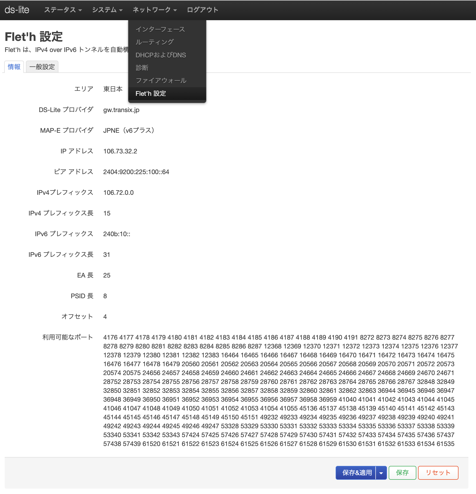
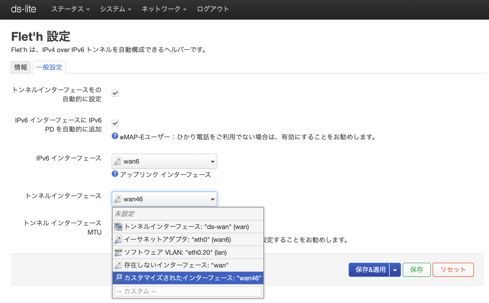

# luci-app-fleth
luci-app-fleth is a helper that can configure your IPv4 over IPv6 tunnel automatically.
> Japan only

[＞＞＞＞＞＞Download here＜＜＜＜＜＜＜](https://github.com/makeding/luci-app-fleth/releases)
# Support ISP
https://qiita.com/site_u/items/b6d5097f5e3a0f91c95d  

## DS-Lite:
- `gw.transix.jp`
    - BB.excite光（コネクト除く）
    - enひかり
    - IIJひかり（東日本　テスト済）
    - インターリンクZOOT NATIVE
    - 株式会社インターリンク ZOOT NATIVE
- `dgw.xpass.jp`
    - BB.excite コネクト
    - enひかり
    - GameWith光
    - 楽天ひかり（東日本　テスト済）
    - Tigers-net
- `dslite.v6connect.net`
    - ASAHIネット光
## MAP-E:
- `BIGLOBE`
- `JPNE（v6プラス）`
    - DMM光
    - GMOとくとくBB
    - enひかり
    - ic-net光コース
    - おてがる光
    - ぷらら（Sコース）(R.I.P.)
- `OCN` (R.I.P.)
- `NURO`

# Screenshots
  

# Compile

prepare your building SDK by yourself.

```
git clone https://github.com/makeding/luci-app-fleth package/huggy/luci-app-fleth
make package/huggy/luci-app-fleth/compile
```

i18n:
```
po2lmo po/ja/fleth.po root/usr/lib/lua/luci/i18n/fleth.ja.lmo
```
# License
MIT