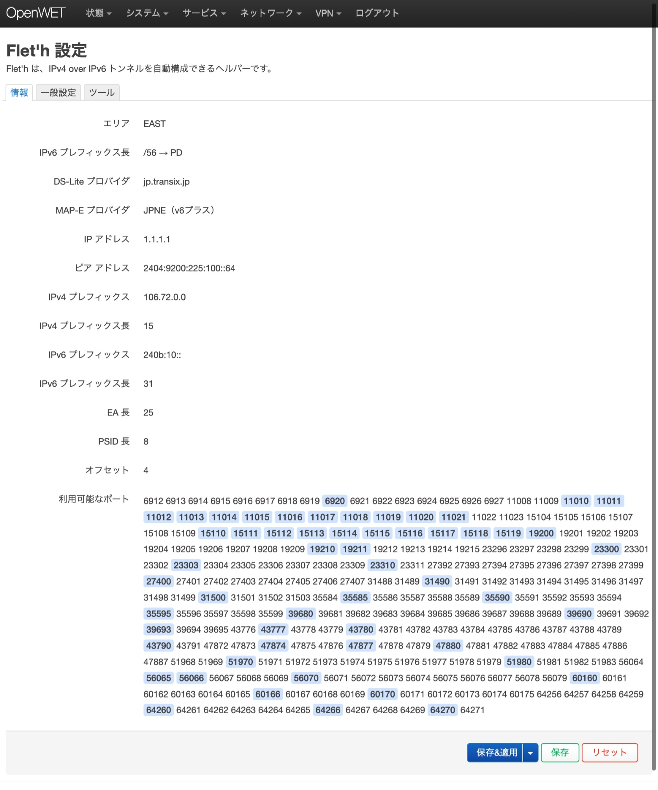
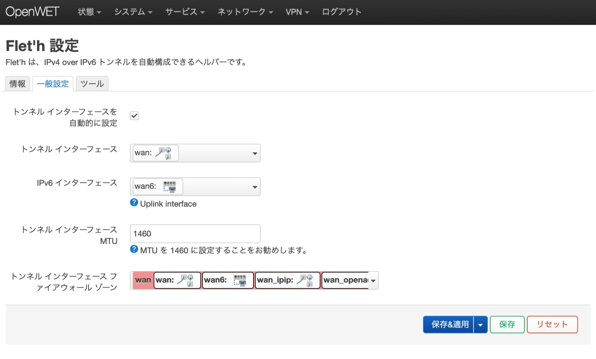
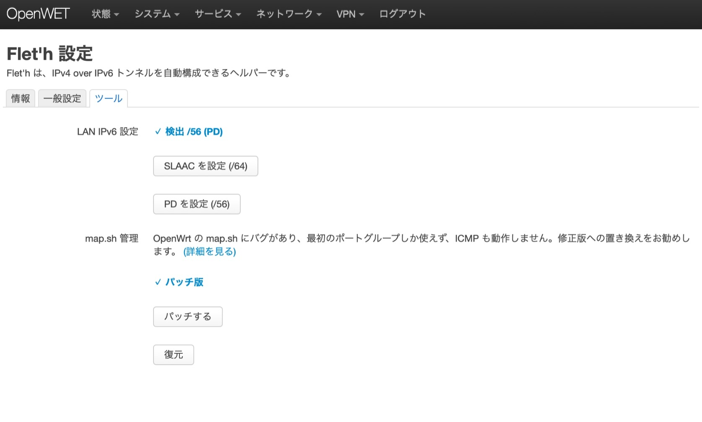
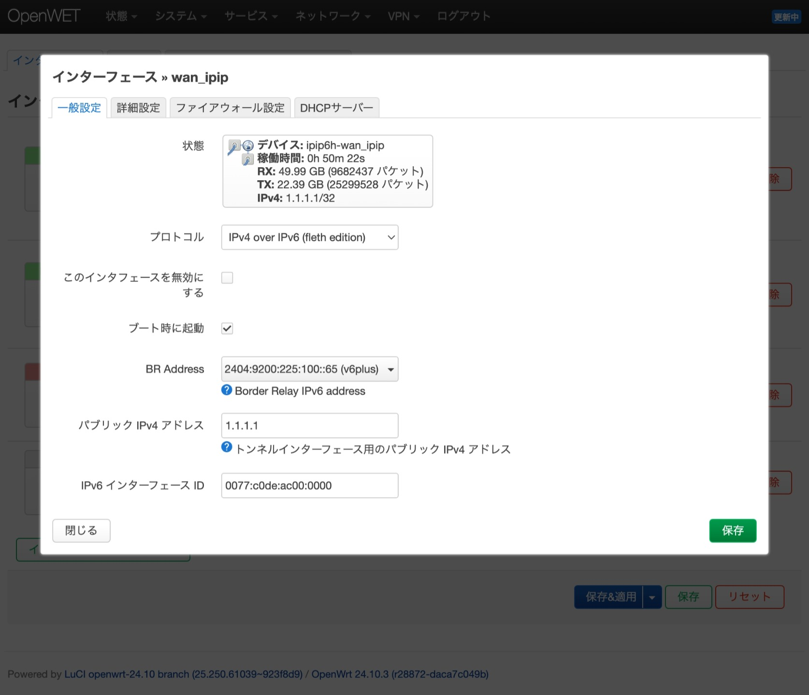
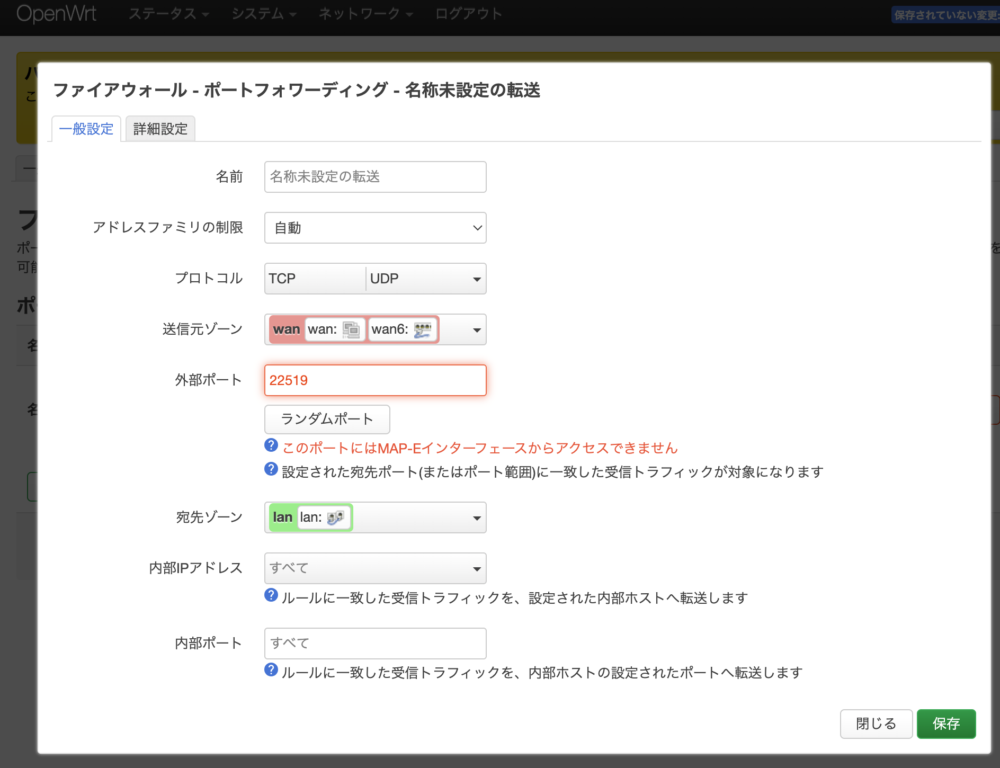

# luci-app-fleth
[Japanese](./readme.md) || [Chinese Simplified](./readme-zhs.md)

luci-app-fleth is a helper that can automatically configure IPv4 over IPv6 tunnels. Supports DS-Lite, MAP-E, and IPIP6 tunnels (Dedicated IP).

> Japan use only

[>>>>>> Download Here <<<<<<](https://github.com/makeding/luci-app-fleth/releases)
# Supported ISPs
https://qiita.com/site_u/items/b6d5097f5e3a0f91c95d  

## DS-Lite:
- `gw.transix.jp`
    - BB.excite光（コネクト と 10Gbps MAP-E PLAN 除く）
    - enひかり
    - IIJひかり（東日本 テスト済）
    - インターリンクZOOT NATIVE
    - 株式会社インターリンク ZOOT NATIVE
- `dgw.xpass.jp`
    - BB.exciteコネクト
    - enひかり
    - GameWith光
    - 楽天ひかり（東日本 テスト済）
    - Tigers-net
- `dslite.v6connect.net`
    - ASAHIネット光
## MAP-E:
- `BIGLOBE`
  - BIGLOBE（西日本 テスト済）
  - おてがる光（東日本 テスト済）
  - BB.excite光 10Gbps MAP-E PLAN（東日本 テスト済）
- `JPNE（v6プラス）`
    - DMM光
    - GMOとくとくBB
    - enひかり（東日本 テスト済）
    - ic-net光コース
    - おてがる光（東日本 テスト済）
    - So-net
    - ぷらら（Sコース）(R.I.P.)
    - 21ip.jp（東日本 テスト済）
- `OCN` (R.I.P.)（東日本 テスト済）
- `NURO`

## Dedicated IP
- `JPNE（v6プラス）`
  - enひかり（東日本 テスト済）
- `SoftBank 光`
  - 1Gbps
  - 10Gbps (Eastern Japan Tested)

# Screenshots
  
  
  
  


# Compilation
Please prepare your own build SDK.

```
git clone https://github.com/makeding/luci-app-fleth package/huggy/luci-app-fleth
make package/huggy/luci-app-fleth/compile
```

i18n:
```
po2lmo po/ja/fleth.po root/usr/lib/lua/luci/i18n/fleth.ja.lmo
```
# License
MIT + GPL2 (If the `luci-proto-ipip6h` component is included in the build)