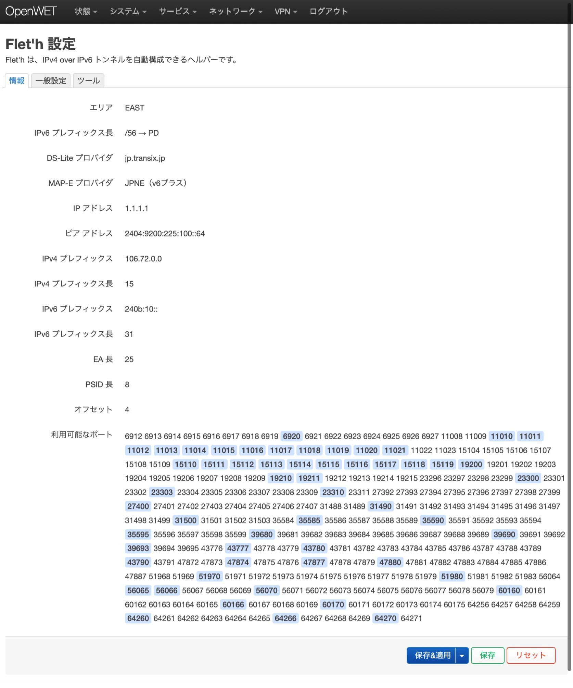
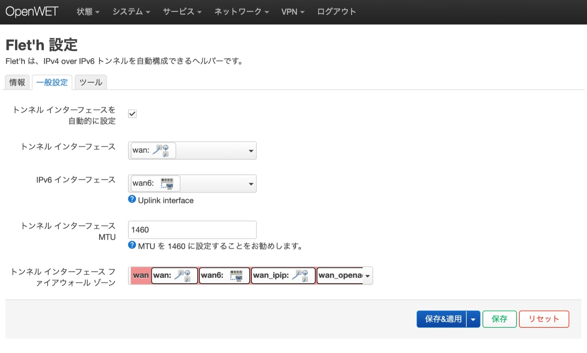
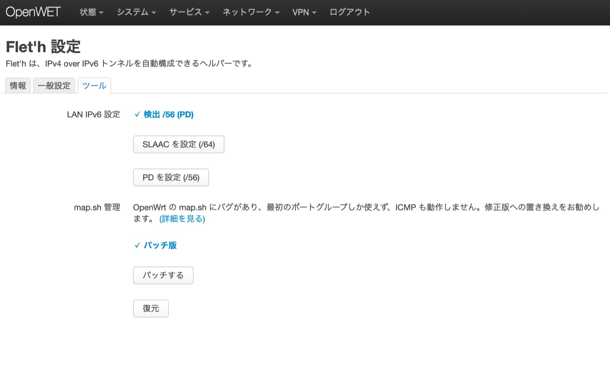
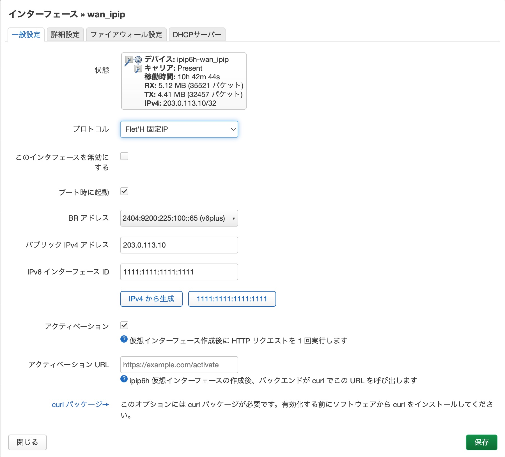
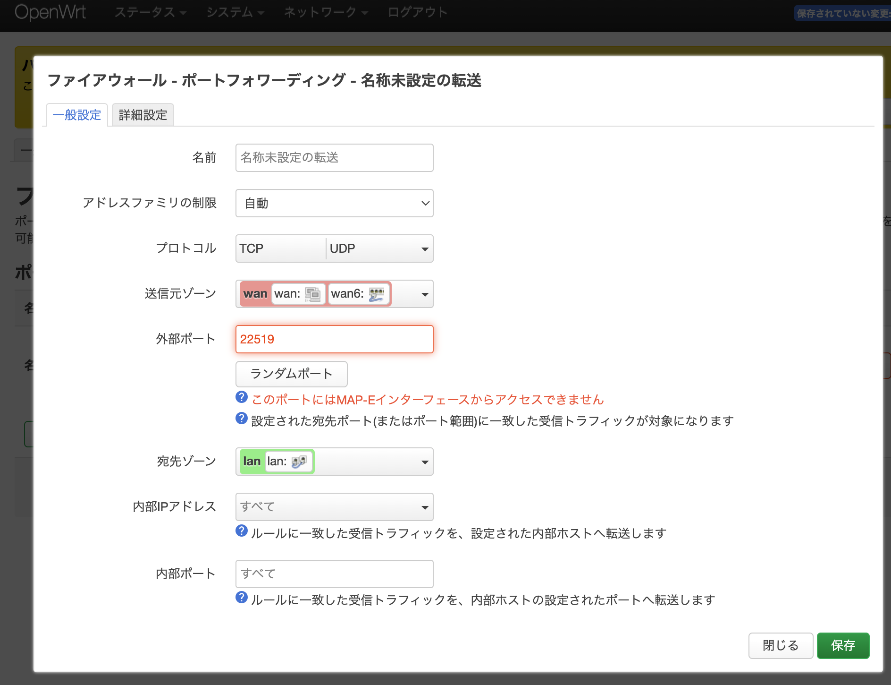

[](https://fleth.link/)
# luci-app-fleth
[Japanese](./readme.md) || [Chinese Simplified](./readme-zhs.md)

luci-app-fleth is a helper that can automatically configure IPv4 over IPv6 tunnels. Supports DS-Lite, MAP-E, IPIP6H tunnels (Dedicated IP), and IPIP6HP passthrough.

- Website: [fleth.link](https://fleth.link/)
- Package feed: [dl.fleth.link](https://dl.fleth.link/)

> Japan use only

**If wan6 cannot obtain IPv6 on OpenWrt 25.12**
If you need connectivity before installing this package, clear `Network → Interfaces → Default DUID`.

> v0.24 is the last release with `map` / `ds-lite` dependencies. See the [v0.24 release note](https://github.com/makeding/luci-app-fleth/releases/tag/v0.24).

# Installation (apk)
OpenWrt 25.12 and later:

```
wget -O /etc/apk/keys/fleth.pem https://dl.fleth.link/fleth.pem
echo 'https://dl.fleth.link/apk/all/packages.adb' > /etc/apk/repositories.d/fleth.list
apk update
apk add luci-proto-fleth
```

# Installation (ipk)
OpenWrt 24.10 and earlier:

```
mkdir -p /etc/opkg/keys
wget -O /etc/opkg/keys/064499bbef2b4ee5 https://dl.fleth.link/opkg/all/064499bbef2b4ee5
echo 'src/gz fleth https://dl.fleth.link/opkg/all' >> /etc/opkg/customfeeds.conf
opkg update
opkg install luci-proto-fleth
```

If the router already has the old `luci-app-fleth` package installed, add the
same feed and install the compatibility package first:

```
opkg install luci-app-fleth
# or
apk add luci-app-fleth
```
# Supported ISPs
https://qiita.com/site_u/items/b6d5097f5e3a0f91c95d  

## DS-Lite:
- `gw.transix.jp`
    - BB.excite光（コネクト と 10Gbps MAP-E PLAN 除く）
    - enひかり
    - IIJひかり（東日本 テスト済）
    - インターリンクZOOT NATIVE
    - 株式会社インターリンク ZOOT NATIVE
- `dgw.xpass.jp`
    - BB.exciteコネクト
    - enひかり
    - GameWith光
    - 楽天ひかり（東日本 テスト済）
    - Tigers-net
- `dslite.v6connect.net`
    - ASAHIネット光（東日本 テスト済）
## MAP-E:
- `BIGLOBE`
  - BIGLOBE（東/西日本 テスト済）
  - おてがる光（東日本 テスト済）
  - BB.excite光 10Gbps MAP-E PLAN（東日本 テスト済）
- `JPNE（v6プラス）`
    - DMM光
    - GMOとくとくBB
    - enひかり（東/西日本 テスト済）
    - ic-net光コース
    - おてがる光（東日本 テスト済）
    - So-net
    - ぷらら（Sコース）(R.I.P.)
    - 21ip.jp（東日本 テスト済）
- `OCN` (R.I.P.)（東日本 テスト済）
- `NURO`

## 固定IP
- `JPNE（v6プラス）`
  - enひかり（東/西日本 テスト済）
- `SoftBank 光`
  - 1Gbps
  - 10Gbps（東日本 テスト済）
- Fixed IP passthrough to a downstream device is also supported.

# Screenshots
  
  
  
  


# Compilation
Please prepare your own build SDK.

```
git clone https://github.com/makeding/luci-app-fleth package/huggy/luci-app-fleth
make package/huggy/luci-app-fleth/compile
```

i18n:
```
po2lmo po/ja/fleth.po root/usr/lib/lua/luci/i18n/fleth.ja.lmo
```
# License
MIT + GPL2 (If the `luci-proto-ipip6h` or `luci-proto-ipip6hp` component is included in the build)
