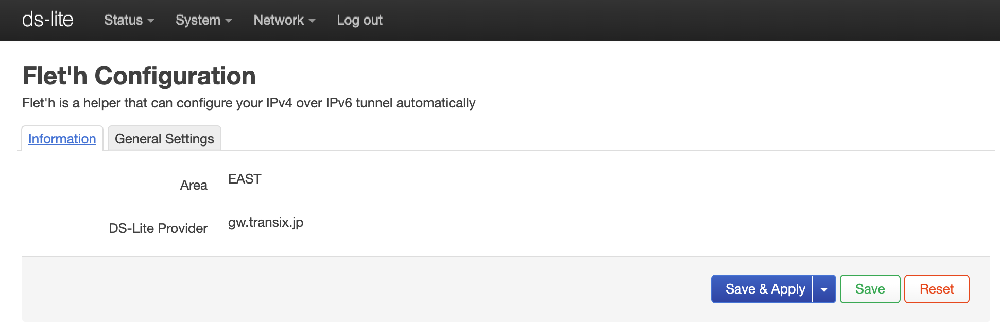

# luci-app-fleth
luci-app-fleth 是一个助手，可以帮您自动配置 IPv4 over IPv6 隧道。
> 只能在日本使用
[＞＞＞＞＞＞请在这里下载＜＜＜＜＜＜＜](https://github.com/makeding/luci-app-fleth/releases)
# 支持的运营商
https://qiita.com/site_u/items/b6d5097f5e3a0f91c95d  

DS-Lite:
- `gw.transix.jp`
    - IIJひかり（東日本　テスト済）
    - インターリンクZOOT NATIVE
    - excite MEC光
    - BB.excite光Fit
    - enひかり
- `dgw.xpass.jp`
    - 楽天ひかり（東日本　テスト済）
    - GameWith光
    - enひかり
    - BB.exciteコネクト
    - Tigers-net
- `dslite.v6connect.net`
    - ASAHIネット光


MAP-E:
- `JPNE（v6プラス）`
    - So-net
    - おてがる光
    - ぷらら（Sコース）(R.I.P)
    - enひかり
    - GMOとくとくBB
    - DMM光
- `BIGLOBE`
- `OCN` (R.I.P)
- `NURO`

# Screenshots
  


# Compile

prepare your building SDK by yourself.

```
git clone https://github.com/makeding/luci-app-fleth package/huggy/luci-app-fleth
make package/huggy/luci-app-fleth/compile
```

# License
MIT