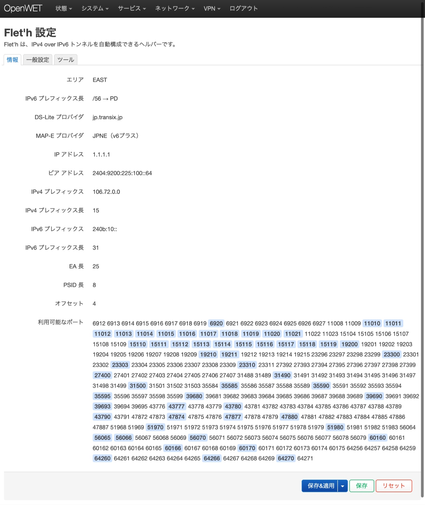

# luci-app-fleth
[日本語](./readme.md) || [English](./readme-en.md)

luci-app-fleth 是一个可以自动配置 IPv4 over IPv6 隧道的辅助工具。支持 DS-Lite、MAP-E 以及 IPIP6 隧道（独立 IP）。

> 仅面向日本

[>>>>>> 点击此处下载 <<<<<<](https://github.com/makeding/luci-app-fleth/releases)
# 对应 ISP
https://qiita.com/site_u/items/b6d5097f5e3a0f91c95d  

## DS-Lite:
- `gw.transix.jp`
    - BB.excite光（コネクト と 10Gbps MAP-E PLAN 除く）
    - enひかり
    - IIJひかり（東日本 テスト済）
    - インターリンクZOOT NATIVE
    - 株式会社インターリンク ZOOT NATIVE
- `dgw.xpass.jp`
    - BB.exciteコネクト
    - enひかり
    - GameWith光
    - 楽天ひかり（東日本 テスト済）
    - Tigers-net
- `dslite.v6connect.net`
    - ASAHIネット光（東日本 テスト済）
## MAP-E:
- `BIGLOBE`
  - BIGLOBE（西日本 テスト済）
  - おてがる光（東日本 テスト済）
  - BB.excite光 10Gbps MAP-E PLAN（東日本 テスト済）
- `JPNE（v6プラス）`
    - DMM光
    - GMOとくとくBB
    - enひかり（東日本 テスト済）
    - ic-net光コース
    - おてがる光（東日本 テスト済）
    - So-net
    - ぷらら（Sコース）(R.I.P.)
    - 21ip.jp（東日本 テスト済）
- `OCN` (R.I.P.)（東日本 テスト済）
- `NURO`

## 独立IP
- `JPNE（v6プラス）`
  - enひかり（東日本 テスト済）
- `SoftBank 光`
  - 1Gbps
  - 10Gbps（东日本 已测试）

# 截图
  
  
  
  


# 编译
请自行准备构建 SDK。

```
git clone https://github.com/makeding/luci-app-fleth package/huggy/luci-app-fleth
make package/huggy/luci-app-fleth/compile
```

国际化:
```
po2lmo po/ja/fleth.po root/usr/lib/lua/luci/i18n/fleth.ja.lmo
```
# 许可证
MIT + GPL2（如果构建中包含 `luci-proto-ipip6h` 组件）