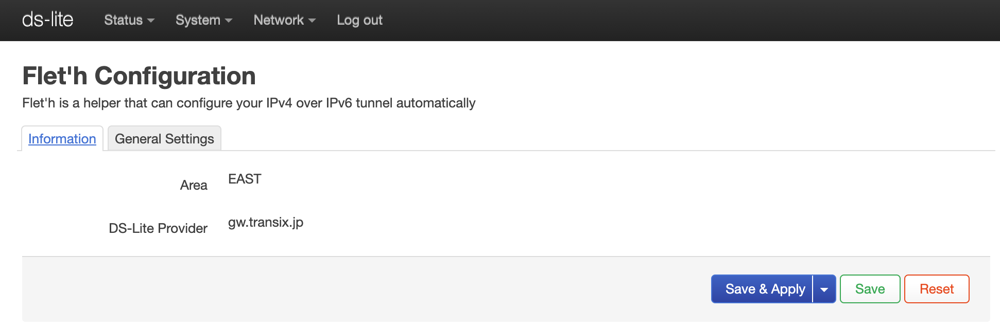
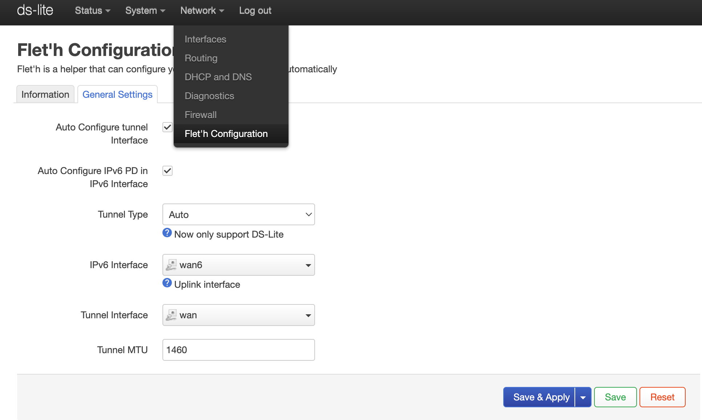

# luci-app-fleth
[English](./readme-en.md) || [Chinese Simplified](./readme-zhs.md)  

luci-app-flethは、IPv4 over IPv6トンネルを自動設定できるヘルパーツールです。
> 日本向け

# 対応 ISP
https://qiita.com/site_u/items/b6d5097f5e3a0f91c95d  

DS-Lite:
- `gw.transix.jp`
    - IIJひかり
    - インターリンクZOOT NATIVE
    - excite MEC光
    - BB.excite光Fit
    - enひかり
- `dgw.xpass.jp`
    - 楽天ひかり
    - GameWith光
    - enひかり
    - BB.exciteコネクト
    - Tigers-net
- `dslite.v6connect.net`
    - ASAHIネット光


MAP-E:
- WIP
> テストの環境がないんので

# スクリーンショット
  


# コンパイル
ビルドSDKを自分で用意してください。

```
git clone https://github.com/makeding/luci-app-fleth package/huggy/luci-app-fleth
make package/huggy/luci-app-fleth/compile
```

# License
MIT