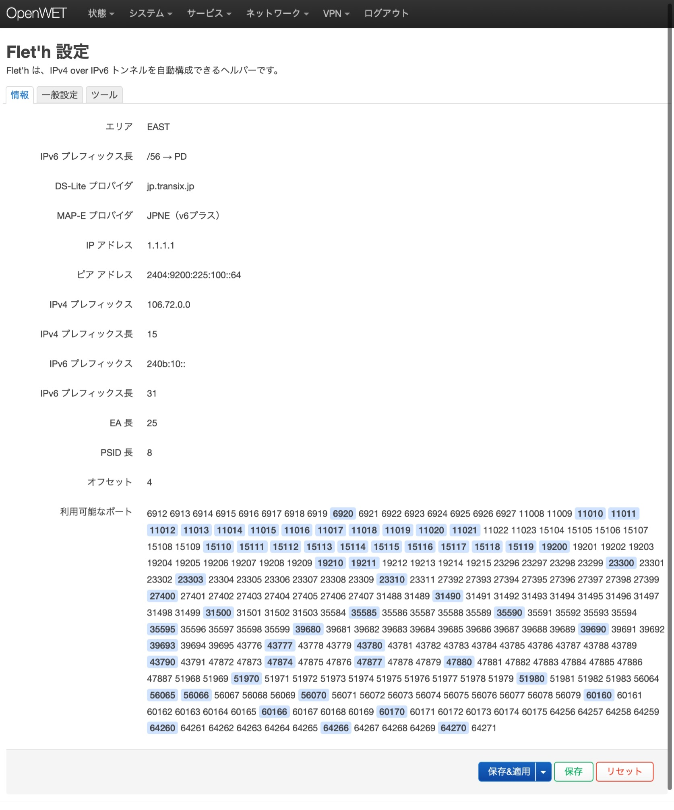
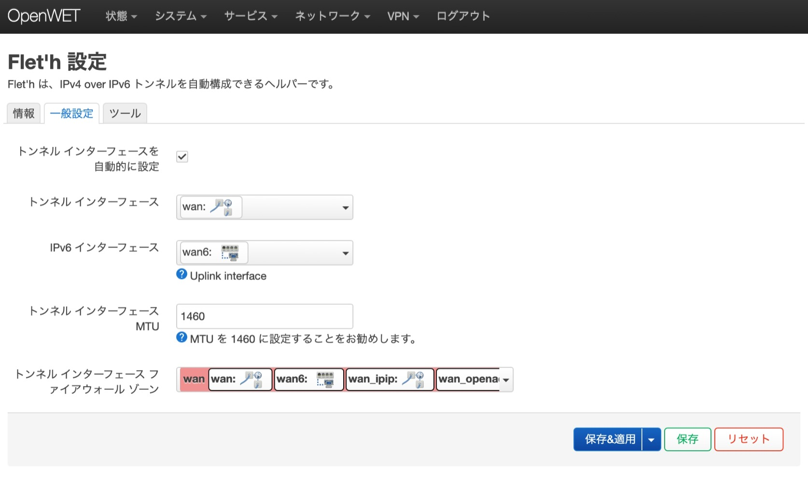
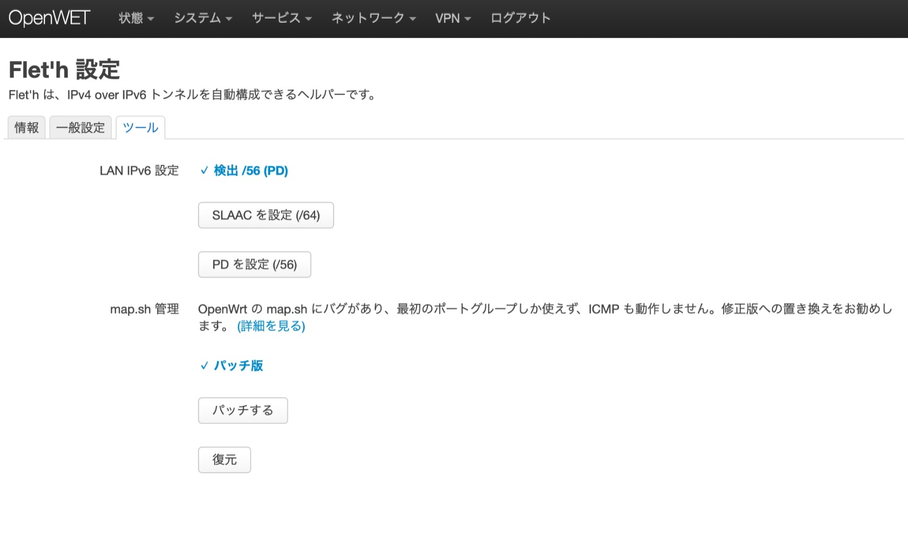
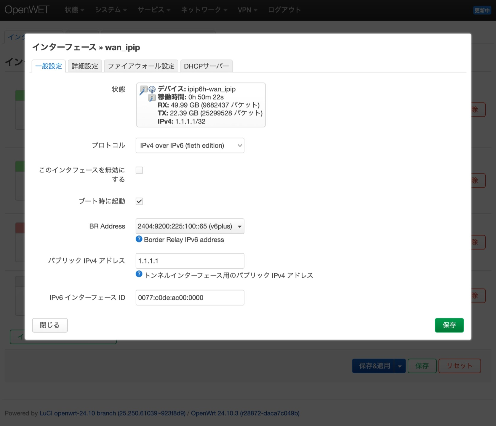
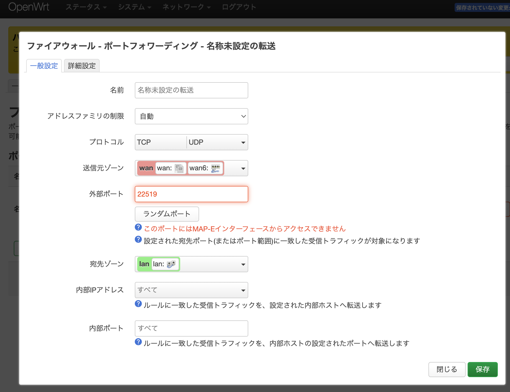

  
# luci-app-fleth
[English](./readme-en.md) || [Chinese Simplified](./readme-zhs.md)  

luci-app-fleth は、IPv4 over IPv6 トンネルを自動構成できるヘルパーです。DS-Lite、MAP-E、IPIP6H トンネル（独立IP）、および IPIP6HP パススルーに対応しています。

> 日本向け

**OpenWrt 25.12 で wan6 が IPv6 を取得できない場合**
インストール前に接続が必要な場合は、`Network → Interfaces → Default DUID` を空にしてください。

[＞＞＞＞＞＞ダウンロードはこちら＜＜＜＜＜＜＜](https://github.com/makeding/luci-app-fleth/releases)
# インストール (apk)
OpenWrt 25.12 以降を使用する場合、署名がまだ無いので `--allow-untrusted` が必要です。

```
apk add --allow-untrusted /tmp/luci-app-fleth_*.apk
```
# 対応 ISP
https://qiita.com/site_u/items/b6d5097f5e3a0f91c95d  

## DS-Lite:
- `gw.transix.jp`
    - BB.excite光（コネクト と 10Gbps MAP-E PLAN 除く）
    - enひかり
    - IIJひかり（東日本 テスト済）
    - インターリンクZOOT NATIVE
    - 株式会社インターリンク ZOOT NATIVE
- `dgw.xpass.jp`
    - BB.exciteコネクト
    - enひかり
    - GameWith光
    - 楽天ひかり（東日本 テスト済）
    - Tigers-net
- `dslite.v6connect.net`
    - ASAHIネット光（東日本 テスト済）
## MAP-E:
- `BIGLOBE`
  - BIGLOBE（東/西日本 テスト済）
  - おてがる光（東日本 テスト済）
  - BB.excite光 10Gbps MAP-E PLAN（東日本 テスト済）
- `JPNE（v6プラス）`
    - DMM光
    - GMOとくとくBB
    - enひかり（東/西日本 テスト済）
    - ic-net光コース
    - おてがる光（東日本 テスト済）
    - So-net
    - ぷらら（Sコース）(R.I.P.)
    - 21ip.jp（東日本 テスト済）
- `OCN` (R.I.P.)（東日本 テスト済）
- `NURO`

## 固定IP
- `JPNE（v6プラス）`
  - enひかり（東/西日本 テスト済）
- `SoftBank 光`
  - 1Gbps
  - 10Gbps（東日本 テスト済）

## IPIP6HP パススルー
IPIP6HP は、独立 IPv4 を OpenWrt ルーターで NAT せず、専用の下流デバイスへ渡すためのプロトコルです。サーバー、既存ルーター、ファイアウォール機器など、公開 IPv4 を直接持たせたい機器向けです。

- 下流クライアント IPv4、CIDR プレフィックス長、クライアント用ゲートウェイ IPv4 を LuCI から設定できます。
- `/31` 構成では、下流クライアント IPv4 からゲートウェイ IPv4 を自動補完します。
- v6プラス / SoftBank 10G 向けに、IPv4 から Interface ID を補完するボタンを利用できます。
- パススルーデバイスは専用利用を推奨します。必要な場合のみ「Allow shared passthrough device」を有効にしてください。
- Proxy ARP、送信元ポリシールーティング、fw4 用 nft ルール、TCP MSS 調整を自動で適用します。

# スクリーンショット
  
  
  
  



# コンパイル
ビルドSDKを自分で用意してください。

```
git clone https://github.com/makeding/luci-app-fleth package/huggy/luci-app-fleth
make package/huggy/luci-app-fleth/compile
```

i18n:
```
po2lmo po/ja/fleth.po root/usr/lib/lua/luci/i18n/fleth.ja.lmo
```
# License
MIT + GPL2(If the `luci-proto-ipip6h` or `luci-proto-ipip6hp` component is included in the build)
